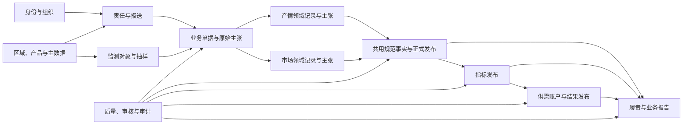

# 齐齐哈尔粮食商情企业平台逻辑数据模型

> 状态：实施前基线
> 日期：2026-07-30
> 上游规格：`docs/specs/2026-07-30-grain-enterprise-unified-business-architecture-spec.md`
> 适用范围：新企业前端、新企业后端和新 MySQL 数据库
> 安全边界：本文不授权连接、修改或删除任何现有数据库

## 一、结论

新版采用独立数据库和模块化单体后端。旧前端、旧后端和旧 MySQL 只作为迁移来源与对账依据，在迁移、并行验收、回退演练和稳定期结束前保持只读可恢复。

逻辑模型以“一个业务事实只有一个权威归属、一个责任坐标同一时刻只有一个可写负责人、正式版本只能追加不能覆盖”为核心，不建立万能宽表，也不把产情、市场、供需和报告重复存成多套事实。

```text
人员与组织
  → 责任岗位、有效任职与责任范围
  → 报送计划、业务期间与报送义务
  → 业务单据、原始主张与证据
  → 质量校验、审核、匹配与规范事实
  → 指标发布版本
  → 供需结果发布版本
  → 日报、周报、月报发布版本
```

## 二、设计边界

### 2.1 保留的分离

以下概念必须独立建模，不得合并成一个“状态”或一个“对象类型”字段：

- 人员、账号、岗位和角色；
- 区域可见权限、业务操作权限和唯一填报责任；
- 报送义务、业务单据、审核任务和发布任务；
- 报送义务状态、时效结果、单据修订状态、审核状态、质量状态和发布状态；
- 经营主体、经营场所、设施、物流节点和样本主体；
- 作物、商品、产品形态、具体品种和质量规格；
- 报价、合同、交付、结算和库存；
- 所有权、保管责任、物理位置和供需统计边界；
- 原始主张、规范事实、指标、供需结果和报告；
- 生产经济成本、现金投入、补贴、保险保费和保险赔付。

### 2.2 禁止的合并

- 不用一张“万能样本点表”承载农户、企业、设施、铁路站点和行政村。
- 不用一张“万能业务宽表”承载所有品种、客户和业务。
- 不把报价当成交，不把合同量当交付量，不把交付量当库存。
- 不把行政村台账、农技站观察和农户样本直接相加。
- 不把库存总量、原料库存、成品库存和政策库存作为可重复加总的并列总量。
- 不把界面筛选条件写死为数据库枚举。
- 不允许报表或文字生成过程重新计算正式指标。

### 2.3 允许的查询投影

为了宽表展示、看板和报告性能，可以建立查询投影、物化结果和缓存，但它们必须：

1. 记录来源版本和生成时间；
2. 能够完全重建；
3. 不接受业务写入；
4. 权限结果不宽于源事实；
5. 失效后回退到上一版正式结果或明确显示不可用。

## 三、通用数据约定

### 3.1 标识

- 每个业务实体使用全局唯一、不可复用的内部标识。
- 人员、组织、区域、产品等稳定身份与其可变版本分离。
- 外部编码、历史编码和导入原值保存在独立映射中，不作为内部主键。
- 正式发布版本另有不可变业务版本号和内容哈希。

### 3.2 时间

必须分别保存：

| 时间           | 含义                                     |
| -------------- | ---------------------------------------- |
| 业务日期       | 现实业务发生日期                         |
| 观测时点       | 库存、价格或状态被观察的时点             |
| 报告期间       | 本次报送归属的日、周、月、年度或营销年度 |
| 服务端接收时间 | 请求正文完整接收并持久化的服务器时间     |
| 提交通过时间   | 阻断校验通过并形成有效提交的时间         |
| 原始截止时间   | 计划最初计算出的截止时间                 |
| 生效截止时间   | 正式延期或日历调整后的截止时间           |
| 系统记录时间   | 数据首次进入系统的时间                   |
| 生效区间       | 主数据、任职、责任和规则的有效起止       |

服务器统一保存带时区时间；业务日历按配置的业务时区计算。客户端时间不能决定是否按时。

### 3.3 数量、金额和单位

- 所有需要计算的数量和金额使用定点小数，不使用二进制浮点。
- 同时保存原始数值、原始单位、标准化数值、标准单位和转换规则版本。
- 面积默认标准单位为公顷，并保留亩数；产量和库存默认标准单位为吨。
- 单产必须携带分子、分母和折算规则，不能只保存一个无单位数字。
- 价格必须携带币种、计价单位、含税口径、交付条件和质量条件。
- 缺失、未采集、不适用、拒答和真实零分别表示。

### 3.4 可追溯字段

所有可变业务记录至少包含：

- 创建人、创建时间；
- 最后修改人、最后修改时间；
- 强版本号；
- 来源请求关联号；
- 当前生命周期状态；
- 逻辑停用原因和时间。

正式事实、正式版本、审计和历史分配记录不允许业务更新或物理删除。

## 四、模块关系总览



## 五、身份、组织与权限

### 5.1 核心实体

| 实体                                   | 主要内容                                 | 核心约束                             |
| -------------------------------------- | ---------------------------------------- | ------------------------------------ |
| 组织空间 `organization_space`          | 系统中的公司或经营管理空间               | 首期可只有一个，但所有授权都显式归属 |
| 组织单元 `organization_unit`           | 公司、部门、区域经营部等层级             | 版本化层级，不用名称关联             |
| 人员 `person`                          | 自然人档案                               | 停用账号不删除人员历史               |
| 账号 `account`                         | 登录身份、安全状态和撤权版本             | 一个账号绑定一个人员；锁定不删除     |
| 认证凭据 `account_credential`          | 密码摘要或外部身份提供方引用             | 与人员业务档案分离，不记录明文       |
| 安全会话 `security_session`            | 会话、账号安全版本、过期和失效时间       | 服务端持久化并可立即撤销             |
| 角色 `role`                            | 填报、审核、发布、治理、管理等职责集合   | 角色不直接等于责任范围               |
| 权限项 `permission`                    | 资源、动作和敏感字段能力                 | 默认拒绝                             |
| 角色权限版本 `role_permission_version` | 角色在有效期内允许或显式禁止的权限       | 显式禁止优先                         |
| 角色授权 `role_grant`                  | 账号或责任岗位在有效期内获得角色         | 排他主体类型、稳定标识和授权来源     |
| 数据访问范围 `data_access_scope`       | 可看区域、对象、业务域和字段             | 查询、搜索、统计、导出一致执行       |
| 职责冲突规则 `segregation_rule`        | 禁止同一人在同一坐标同时提交、审核或发布 | 保存规则版本和例外审批               |

### 5.2 权限判定

一次业务动作必须同时满足：

```text
账号有效
且人员有效
且角色允许该动作
且数据访问范围覆盖目标
且责任范围允许该业务写入
且对象、期间和状态允许该动作
且不违反职责冲突规则
```

区域“可编辑”只表示能力范围，不代表该账号是某项报送的唯一负责人。

### 5.3 隐私、留存与法律冻结

| 实体                                   | 主要内容                             | 核心约束                             |
| -------------------------------------- | ------------------------------------ | ------------------------------------ |
| 数据分类 `data_classification`         | 公开、内部、敏感个人、政策敏感等分类 | 分类跟随字段和产物，不只跟随页面     |
| 字段保护策略 `field_protection_policy` | 查看、脱敏、导出和传播规则           | 查询、搜索、日志、导出和报告一致执行 |
| 访问用途 `access_purpose`              | 访问、导出和报告使用目的             | 敏感访问必须有允许用途               |
| 留存策略 `retention_policy`            | 分类对应的在线、归档和销毁期限       | 正式版本与审计不得被普通业务删除     |
| 法律冻结 `legal_hold`                  | 暂停归档销毁的范围、原因和审批       | 冻结期间禁止销毁                     |

农户使用稳定匿名标识。姓名、电话、证件和精确住址只在明确必要时保存，并与统计事实分离。履责报告属于人员管理数据，必须单独限制查看、导出和传播。

## 六、区域、产品与主数据

### 6.1 地理模型

| 实体                                         | 主要内容                                     |
| -------------------------------------------- | -------------------------------------------- |
| 区域稳定身份 `region`                        | 不随更名变化的区域标识                       |
| 行政区划版本 `administrative_region_version` | 名称、类型、行政代码、生效期和来源           |
| 区划层级关系 `region_hierarchy_version`      | 父子关系、生效期和统计口径                   |
| 业务管理区域 `business_region`               | 齐齐哈尔指定范围、黑河全域、呼伦贝尔指定范围 |
| 业务区域成员 `business_region_member`        | 指定区划版本下的成员和纳入理由               |
| 统计区域映射 `statistical_region_mapping`    | 供需统计边界与行政区的映射                   |

行政村和自然村使用不同区域类型。村级行政汇总只接受行政村。

### 6.2 产品模型

| 实体                                   | 主要内容                                 |
| -------------------------------------- | ---------------------------------------- |
| 作物 `crop`                            | 玉米、大豆、水稻等生物作物               |
| 商品 `commodity`                       | 可交易或统计的粮食商品                   |
| 产品形态 `product_form`                | 原粮、大米、豆粕、豆油、副产品等         |
| 具体品种 `cultivar`                    | 可由业务人员录入后进入待治理映射         |
| 产品定义 `product_definition`          | 作物、商品、形态和品种的有效组合         |
| 产品转换规则 `product_conversion_rule` | 稻谷转大米、原豆转豆粕和豆油等版本化规则 |
| 供需产品账户 `product_account`         | 玉米、原豆、稻谷、大米等互斥账户         |

临时品种名称保留原值，经治理确认后增加映射，不覆盖原始填报。

### 6.3 质量和单位

| 实体                                          | 主要内容                           |
| --------------------------------------------- | ---------------------------------- |
| 单位定义 `unit_definition`                    | 吨、千克、斤、亩、公顷、元/吨等    |
| 单位转换版本 `unit_conversion_version`        | 转换公式、生效期和精度             |
| 质量指标定义 `quality_item_definition`        | 水分、容重、蛋白、毒素、杂质等     |
| 质量标准版本 `quality_standard_version`       | 产品、等级、方法和阈值             |
| 业务能力定义 `business_capability_definition` | 贸易、仓储、加工、物流、政策保管等 |

## 七、责任与报送

### 7.1 责任范围键与有效期

不含时间的规范责任范围键 `responsibility_scope_key` 至少由以下维度组成：

```text
组织空间
＋业务域
＋报送事项
＋版本化地理范围
＋版本化对象范围
＋版本化产品范围
＋报送频率
```

允许某些维度使用明确的“全部适用”，但不能用空值表达未知范围。有效期不进入范围键或其哈希，而是保存在责任范围版本、任职和责任分配的半开区间中。

父子区域、对象组与对象、全部产品与具体产品可能使用不同范围键却相互覆盖。因此每个范围版本必须按照固定的行政区划、对象组和产品主数据版本，展开为确定性排序的原子范围叶子 `responsibility_scope_leaf`。分配事务按排序后的叶子键依次加锁后检查全部有效期重叠，不能只锁一个范围哈希。

### 7.2 核心实体

模块归属固定为：`responsibility_position`、`effective_appointment` 及其标识由“身份与组织”模块共同拥有，任职必须引用一个责任岗位；“责任与报送”模块只通过公开 `AppointmentId` 引用有效任职，不同时接受人员标识和岗位标识作为第二权威来源。责任范围、指派、交接、义务和单据由“责任与报送”模块拥有。

| 实体                                          | 主要内容                                         | 核心约束                             |
| --------------------------------------------- | ------------------------------------------------ | ------------------------------------ |
| 责任岗位 `responsibility_position`            | 持续承担某类事项的岗位                           | 与人员、账号分离                     |
| 有效任职 `effective_appointment`              | 人员在半开有效期内担任岗位                       | 历史只追加                           |
| 规范责任范围键 `responsibility_scope_key`     | 不含时间的业务、区域、对象、产品和频率组合       | 规范化后唯一                         |
| 责任范围版本 `responsibility_scope_version`   | 范围键、主数据版本和半开有效期                   | 生效后不可覆盖                       |
| 原子范围叶子 `responsibility_scope_leaf`      | 展开后的行政、对象和产品最小授权单元             | 用于相交检测与确定性多锁             |
| 责任分配 `responsibility_assignment`          | 某有效任职对某范围版本的负责关系                 | 同一原子范围同一时刻一个正式可写任职 |
| 责任转移申请 `responsibility_transfer`        | 原任职、新任职、原因、生效时间、任务处置和审批   | 原子生效且无重叠或空档               |
| 责任转移决定 `responsibility_transfer_review` | 申请人、审批人、决定、证据和完成时间             | 申请人不得批准自己的转移             |
| 报送计划 `reporting_plan`                     | 稳定计划身份                                     | 只有发布版本才能生成义务             |
| 报送计划版本 `reporting_plan_version`         | 表单、频率、日历、截止、质量和审核链             | 生效后不可覆盖                       |
| 业务日历版本 `business_calendar_version`      | 工作日、节假日、调休和时区                       | 可重现                               |
| 报告期间 `reporting_period`                   | 日、周、月、作物年度或营销年度                   | 由计划生成                           |
| 报送义务 `reporting_obligation`               | 某范围键某期间的一次应报责任                     | 计划版本＋范围键＋期间唯一           |
| 义务负责人快照 `obligation_owner_snapshot`    | 生成时负责人、当前唯一写入人、截止时刻最终归责人 | 三者及其有效任职分别保存             |
| 截止规则快照 `deadline_snapshot`              | 原始截止、生效截止、批准时间、宽限结束和依据     | 后续变更不覆盖原值                   |
| 提交接收 `submission_receipt`                 | 服务端接收、校验开始、完成、结果和首次合格引用   | 幂等且不可覆盖                       |
| 单义务截止快照 `obligation_cutoff_snapshot`   | 截止时点单个义务的责任和时效事实                 | 后续补填不改写                       |

### 7.3 唯一负责人约束

数据库通过不含时间的范围键、原子叶子锁和有效期无重叠校验共同保证：

1. 任一相交原子范围任一时刻最多一个正式可写有效任职；
2. 草稿保存和提交都在事务内重新校验当前分配；
3. 管理员、审核人和发布人不能绕过该约束；
4. 系统不提供代填或代报；请假、离职和组织调整只能通过正式责任转移处理；
5. 正式转移同时更新任职、分配、受影响义务、冻结原草稿、建立新修订来源和审计；任一步失败整体回滚；
6. 转移与提交并发时使用责任版本号和事务提交顺序判定，过期责任版本的提交必须拒绝；
7. 批量导入的上传人不自动获得确认或提交权。

### 7.4 独立状态

`reporting_obligation` 只保存义务生命周期：

```text
未开放 → 进行中 → 已到期 → 已关闭

并列终态：正式免报、正式取消
```

以下结果保存为独立字段或独立记录：

- 时效：待判定、按时提交、截止未提交、逾期后补交、不适用；
- 单据修订：草稿、已提交、已撤回、已作废、已被新修订替代；
- 审核流程：未开始、审核中、审核通过；并列结果为退回整改、审核拒绝、审核取消；
- 发布版本：候选准备中、候选就绪、已发布、已被替代；并列状态为候选作废、已撤回；
- 质量评估：未评估、通过、警告、阻断。

退回是审核结果，不是单据状态。被退回的已提交修订保持不可变，整改创建引用它的新草稿和新审核实例。

状态组合完整继承冻结规格第 5.7 节的最低允许矩阵，矩阵外默认拒绝。计划可以引用更严格的版本化矩阵，但不能放宽阻断质量、审核未通过、撤回版本和正式免报等全局不变量。

每期义务分别保存原始时效结果、生效时效结果和例外处置结果：

- 原始时效结果始终按原始截止时间判定；
- 生效时效结果只采用截止前已经批准的有效截止时间；
- 截止后批准的延期、豁免或取消不能改写原始时效，只能形成例外处置；
- 首次合格提交时间取已经固定的服务端接收时间；
- 服务端接收前必须完成身份、责任、完整请求体、幂等键和请求摘要检查并持久化；
- 阻断校验失败不产生首次合格提交时间，重新提交生成新的接收记录。

## 八、监测对象与抽样

### 8.1 主体和地点

| 实体                                       | 主要内容                                 |
| ------------------------------------------ | ---------------------------------------- |
| 经营主体 `business_party`                  | 法人、个体经营者、农户、政府或组织       |
| 经营场所 `operating_site`                  | 主体开展经营活动的地点                   |
| 设施 `facility`                            | 仓库、工厂、生产线、门店等物理资源       |
| 物流节点 `logistics_node`                  | 铁路站、公路节点等网络节点               |
| 主体设施关系 `party_facility_relationship` | 所有、经营、租赁、代储、受托管理及有效期 |
| 样本主体 `monitoring_subject`              | 被纳入监测方案的主体、场所或设施引用     |
| 业务角色定义 `business_role_definition`    | 贸易商、加工企业、承储企业等网络身份     |
| 对象角色任期 `object_role_assignment`      | 主体在半开有效期内承担一个或多个角色     |
| 对象业务能力 `object_capability`           | 某主体或设施在有效期内具备的适用业务能力 |
| 能力模板版本 `capability_template_version` | 为角色或设施提供可审核的默认能力和字段   |
| 模板能力关系 `template_capability`         | 模板、能力、适用对象和默认规则           |

同一企业只建立一个经营主体。一个主体可以同时承担多个角色并拥有多个能力；选择模板只生成可审核配置，不复制主体，也不永久锁死角色、能力或字段。设施类型、业务角色、业务能力和能力模板四者不得混用。

### 8.2 抽样

| 实体                                     | 主要内容                             |
| ---------------------------------------- | ------------------------------------ |
| 监测方案版本 `monitoring_scheme_version` | 目标总体、地区、产品、频率和估计方法 |
| 抽样框版本 `sampling_frame_version`      | 候选总体和来源                       |
| 样本成员 `sample_membership`             | 入样、替换、退出、失联和拒访         |
| 样本权重版本 `sample_weight_version`     | 基础权重、校准权重和适用期间         |
| 区域估计运行 `regional_estimation_run`   | 输入版本、方法、覆盖率、区间和结果   |

行政台账、农技站观察和农户样本分别标记来源通道；只有经过正式估计规则才能形成区域指标。

## 九、业务单据、主张与规范事实

### 9.1 单据

| 实体                            | 主要内容                                 |
| ------------------------------- | ---------------------------------------- |
| 业务单据 `business_document`    | 义务、对象、期间、表单版本和当前修订指针 |
| 单据修订 `document_revision`    | 一次完整草稿或提交版本                   |
| 单据分区 `document_section`     | 同一审核边界内的业务分区                 |
| 字段原值 `document_field_value` | 原始值、单位、缺失原因和来源             |
| 附件证据 `evidence_attachment`  | 文件哈希、类型、来源和访问级别           |
| 导入批次 `import_batch`         | 文件、模板、解析器、哈希和目标义务       |
| 导入行 `import_row`             | 原文、行号、行哈希、匹配和校验结果       |

业务单据按责任人、报告期间、审核边界和表单版本划分。不同频率或审核边界不强行塞进同一单据。

### 9.2 从主张到事实

| 实体                                | 主要内容                                 |
| ----------------------------------- | ---------------------------------------- |
| 原始主张 `raw_claim`                | 某来源对某业务事项的原始陈述             |
| 主张证据关联 `claim_evidence_link`  | 主张与附件、样品、单据和导入行关系       |
| 匹配簇 `matching_cluster`           | 可能描述同一现实事件的多方主张           |
| 冲突记录 `claim_conflict`           | 不一致字段、影响、处置和结论             |
| 规范事实 `canonical_fact`           | 经质量、审核和去重后可发布的唯一事实     |
| 事实构成 `canonical_fact_component` | 规范事实与原始主张的采用、排除或调整关系 |
| 批准调整 `approved_adjustment`      | 有原因、审批和影响范围的显式调整         |

规范事实不覆盖原始主张。多方报告同一运输、交易或库存时，先匹配和冲突处置，再形成唯一规范事实。

## 十、产情监测模型

### 10.1 种植生产

| 实体                                         | 主要内容                                         |
| -------------------------------------------- | ------------------------------------------------ |
| 农业经营档案 `agricultural_holding_profile`  | 经营主体的农业经营扩展，不复制主体               |
| 农户家庭档案 `farm_household_profile`        | 家庭样本、匿名标识、居住地和敏感信息引用         |
| 受访人关系 `respondent_assignment`           | 受访人与样本主体、调查轮次、联系方式权限和有效期 |
| 地块 `land_parcel`                           | 稳定地块、面积、权属、耕地实际所在地和生效期     |
| 作物季 `crop_season`                         | 作物年度、产品、播种到收获的完整生产周期         |
| 作物季地块 `crop_season_land`                | 作物季与地块、计划面积和实际面积关系             |
| 耕地统计位置 `cultivation_location`          | 耕地实际所在地行政村及上级区划                   |
| 种植面积观察 `planting_area_observation`     | 播种、收获、弃收或未收获面积和口径               |
| 生育进程观察 `crop_growth_observation`       | 生育阶段、进度、观测日期和方法                   |
| 墒情观察 `soil_moisture_observation`         | 地块或区域墒情、深度、方法和等级                 |
| 农业灾害事件 `agricultural_hazard_event`     | 受灾、成灾、绝收面积、严重程度和经济损失         |
| 病虫害观察 `pest_disease_observation`        | 病虫害类型、发生面积、严重度和防治               |
| 测产轮次 `yield_sampling_round`              | 轮次、样方、方法、原始测量和不确定性             |
| 单产观察 `yield_observation`                 | 原始斤/亩、标准吨/公顷、方法和样本               |
| 收获进度观察 `harvest_progress_observation`  | 已收面积、进度、日期和来源                       |
| 产量派生主张 `production_quantity_claim`     | 收获面积×单产或核准台账形成的待治理产量主张      |
| 村级行政台账 `village_administrative_ledger` | 行政村口径的台账来源                             |
| 农技站专业观察 `agri_station_observation`    | 农情、灾情、测产和技术估测来源                   |

村、乡镇、区县、地级市之间的汇总通过区域层级与同一统计口径计算，不要求每个来源通道彼此机械相等。只有同源、同口径的行政台账才执行严格上下级守恒。

面积勾稽固定为“播种面积＝收获面积＋弃收或未收获面积”。灾害影响面积、成灾面积和绝收面积属于灾害事件及严重程度；只有绝收并确认未收获的面积进入弃收或未收获面积构成，不能与收获面积并列相加。

本节和市场监测模型中的记录首先形成领域记录、原始主张和证据，不因字段名称或页面审核状态自动成为正式事实。只有经过第十二章共用质量、审核、匹配和发布链，才能进入规范事实与正式版本。

### 10.2 成本、补贴和保险

| 实体                                          | 主要内容                                       |
| --------------------------------------------- | ---------------------------------------------- |
| 生产资源经济成本 `production_economic_cost`   | 地租、种子、农药、化肥、灌溉、人工、机耕等发生 |
| 生产资源现金支出 `production_cash_payment`    | 农户实际支付金额和时间                         |
| 成本适用面积 `cost_applicable_area`           | 每项经济成本或现金支出的实际分摊面积           |
| 种植补贴应计 `subsidy_entitlement`            | 补贴类型、每亩标准、适用面积和应收金额         |
| 种植补贴实收 `subsidy_receipt`                | 实际到账金额、时间和应计引用                   |
| 保险投保 `insurance_coverage`                 | 保险面积、保额、总保费和保单                   |
| 保险保费承担 `insurance_premium_contribution` | 财政补助和农户自缴各自金额                     |
| 保险赔付 `insurance_compensation`             | 灾害、核损、应赔和实际赔付                     |
| 灾害经济损失 `disaster_economic_loss`         | 独立损失事实，不与成本或赔付相互冲销           |

正式派生公式：

```text
生产经济成本
= 不含保险的生产资源经济成本
+ 保险总保费

农户现金投入
= 农户实际支付的生产资源支出
+ 农户自缴保费

政策支持
= 已确认种植补贴
+ 政府承担的保险保费补助
+ 其他经批准支持

实际收到的现金政策支持
= 农户实际收到的种植补贴
+ 农户实际收到的其他现金支持

扣除现金补贴后的种植现金负担
= 农户现金投入
− 实际收到的现金政策支持

扣除保险赔付后的净资金负担
= 扣除现金补贴后的种植现金负担
− 农户实际收到的保险赔付
```

政府承担的保险保费补助不从农户现金投入再次扣除。补贴不以负成本行存储，保险赔付不冲减生产经济成本，灾害损失也不与赔付相互抵销。每项事实保存自己的适用面积和分摊依据。

### 10.3 农户库存、销售和种植意愿

| 实体                                       | 主要内容                                 |
| ------------------------------------------ | ---------------------------------------- |
| 农户库存快照 `farmer_stock_snapshot`       | 产品、所有者、保管方、地点、时点和数量   |
| 农户库存变动 `farmer_inventory_movement`   | 唯一权威数量事件和前后库存勾稽           |
| 农户销售明细 `farmer_sale_detail`          | 销售变动的一对一扩展：价格、买方和交付日 |
| 农户代存关系 `farmer_storage_relationship` | 代存方、地点、生效期和保管责任           |
| 种植意愿 `planting_intention`              | 下一年度计划面积、原因和调查时点         |

库存变动类型固定包括收获入库、购入、受赠、转入、转出、代存开始、代存结束、自用、饲用、种用、销售、损耗和批准调整。每条变动分别声明“所有权数量效应、物理位置效应、保管责任效应”，不能用一个正负数量同时表达三种变化。收获入库、购入、受赠、转入、转出、自用、饲用、种用、销售、损耗和批准调整可以改变所有权数量；代存开始和代存结束的所有权数量效应固定为零，只改变物理位置和／或保管责任。销售数量只保存于 `farmer_inventory_movement`，`farmer_sale_detail` 不再保存第二份可竞争数量。

累计销售量和销售比例由有效销售变动及可解释的分母计算，不重复填写。代存只改变物理位置或保管方，不自动改变所有权。期末库存经正式滚转成为下一期期初候选，后续盘点差异单独记录。

## 十一、市场监测模型

### 11.1 角色、能力与农资业务

统一经营主体档案通过 `object_role_assignment` 和 `object_capability` 组合出贸易商、玉米深加工、大豆压榨、大豆蛋白加工、食品和调味品企业、米厂、饲料企业、养殖企业、承储企业、批发市场运营方和农资经销商等业务形态。角色与能力分别生效、停用和审核，不能用“企业类型”复制主体。

| 实体                                             | 主要内容                                 |
| ------------------------------------------------ | ---------------------------------------- |
| 农资产品 `agricultural_input_product`            | 种子、农药、化肥的分类、品牌、规格和单位 |
| 农资销售事件 `agricultural_input_sale_event`     | 产品、数量、价格、客户范围和销售时间     |
| 农资库存快照 `agricultural_input_stock_snapshot` | 农资经销商的指定时点库存                 |

农资销售属于同一主体全景档案中的适用业务板块，不建立另一份“经销商企业”档案，也不进入粮食物理供需账户。

### 11.2 质量与批次

| 实体                          | 主要内容                           |
| ----------------------------- | ---------------------------------- |
| 粮食批次 `grain_lot`          | 产品、来源、初始数量证据和质量身份 |
| 批次份额 `lot_portion`        | 拆分后的稳定身份、创建量证据和状态 |
| 批次关系 `lot_lineage`        | 拆分、合并、加工和转换关系         |
| 样品 `quality_sample`         | 取样时间、地点、方法和批次         |
| 质量检验 `quality_inspection` | 标准、方法、指标结果和检验方       |

批次初始数量和份额创建量是不可变来源与守恒证据，不表示当前库存。批次拆分、合并和转换必须守恒。当前可用物理数量只有第 11.4 节的 `inventory_position` 持有；一个批次份额在同一时点只有一个当前物理位置和一个当前数量状态。

### 11.3 报价、交易、交付与结算

| 实体                        | 主要内容                                 |
| --------------------------- | ---------------------------------------- |
| 报价 `market_quote`         | 买卖方向、产品、价格、质量、交付和有效期 |
| 交易协议 `trade_agreement`  | 买卖双方、条款和约定数量                 |
| 交易行 `trade_line`         | 产品、数量、价格和质量条件               |
| 交付事件 `delivery_event`   | 实际交付数量、批次和时间                 |
| 结算事件 `settlement_event` | 结算价格、扣价、税费和金额               |
| 取消退货 `trade_reversal`   | 取消、退货和冲销关系                     |

只有规范交付或经账户规则明确采用的事件进入供需数量。报价只用于价格分析。

### 11.4 库存

| 实体                                                  | 主要内容                                       |
| ----------------------------------------------------- | ---------------------------------------------- |
| 库位或在途位置 `physical_storage_position`            | 仓库库位、车辆、列车或“在途待定位”位置         |
| 物理库存持仓 `inventory_position`                     | 批次份额、唯一物理位置、时点和权威数量         |
| 库存移动 `inventory_movement`                         | 当前持仓变化的不可变数量、位置和原因事件       |
| 所有权份额 `lot_ownership_share`                      | 批次份额的所有者或权益方及权益比例             |
| 保管责任 `custody_assignment`                         | 批次份额、保管方、起止时间和证据               |
| 库存性质 `inventory_policy_attribute`                 | 商业、政策及具体政策计划属性                   |
| 库存用途 `inventory_use_attribute`                    | 原料、在制品、成品、商品、待售等经营用途       |
| 粮源属性 `inventory_origin_attribute`                 | 国产、进口及受控来源分类                       |
| 库存快照 `inventory_snapshot`                         | 指定时点的持仓集合哈希和数量                   |
| 库存盘点 `inventory_count`                            | 实盘数量、账面数量和差异                       |
| 库存差异处置 `inventory_adjustment`                   | 差异原因、批准、影响和版本                     |
| 所有权转移 `ownership_transfer`                       | 所有权或权益份额变化时间                       |
| 保管转移 `custody_transfer`                           | 保管责任变化时间                               |
| 库存采用规则 `inventory_adoption_rule_version`        | 盘点、流水和调查结果的采用顺序与门禁           |
| 库存合并矩阵 `inventory_consolidation_matrix_version` | 主体、设施、所有权、属性和状态的纳入或排除规则 |

“企业库存”是按授权企业范围查询得到的总视图，不是可与原料、成品或政策库存再次相加的库存类型。`inventory_position` 是唯一可写当前物理数量；`inventory_movement` 是其不可变历史变化，二者必须原子勾稽。`grain_lot`、`lot_portion` 的创建量以及 `inventory_snapshot`、`inventory_count` 都不是第二份可写当前数量，快照只能从固定持仓版本派生。

同一原子批次份额同一时点只有一个物理位置和一个权威物理数量；权益方可以有多个，但份额总和必须守恒。装货交接后从起点库位转入在途位置；位置无法证明时进入“在途待定位”，不分配给起点或终点静态库存，并由质量门禁决定是否阻断正式区域总量。

### 11.5 加工与消费

| 实体                                    | 主要内容                     |
| --------------------------------------- | ---------------------------- |
| 加工设施能力 `processing_capability`    | 适用品种、产能和生产线       |
| 加工运行 `processing_run`               | 期间、生产线、开机时长和状态 |
| 加工投入 `processing_input`             | 原料批次份额和标准数量       |
| 加工产出 `processing_output`            | 主要产品、副产品和在制品     |
| 加工损耗 `processing_loss`              | 损耗量和原因                 |
| 直接消费事件 `direct_consumption_event` | 食用、饲用、种用等非加工用途 |

加工投料和产品转换由批次关系连接。原料投入、产出、副产品、损耗和在制品变化必须在配置容差内守恒。每次加工固定原重、标准水分重量或干物质重量基准、水分标准、杂质扣除、舍入和转换率版本；“原粮当量”只作为派生指标，不伪装成物理库存。

### 11.6 物流

| 实体                                     | 主要内容                           |
| ---------------------------------------- | ---------------------------------- |
| 运输单 `shipment`                        | 委托方、承运方、产品和总量         |
| 运输分段 `shipment_leg`                  | 铁路或公路、起点、终点、起止时间   |
| 装卸事件 `shipment_handling_event`       | 装车、到达、卸车和称重             |
| 边界穿越 `statistical_boundary_crossing` | 进入或离开供需统计区域的时间和数量 |

同一票运输可含多个分段。区域流入和流出只由统计边界穿越产生，区域内部运输不计流入或流出。

### 11.7 政策业务

| 实体                                  | 主要内容                                                 |
| ------------------------------------- | -------------------------------------------------------- |
| 政策计划版本 `policy_program_version` | 收储、拍卖、投放和储备规则                               |
| 政策授权 `policy_authorization`       | 主体、设施、产品、数量和有效期                           |
| 政策执行事件 `policy_execution_event` | 收购、入库、移库、轮换、投放、拍卖、出库、内部转移和结清 |
| 政策库存账户 `policy_stock_account`   | 政策性质、授权和物理持仓／所有权引用                     |

没有有效政策授权时不能把普通库存标为政策库存。政策账户不得保存第二份独立物理数量，只能引用同一原子批次份额、物理持仓和所有权份额。政策体系内部转移不增加区域总供给或总使用与外流。

## 十二、质量、审核与发布

### 12.1 质量

| 实体                                  | 主要内容                       |
| ------------------------------------- | ------------------------------ |
| 质量规则版本 `quality_rule_version`   | 适用对象、条件、严重度和表达式 |
| 质量评估运行 `quality_evaluation_run` | 固定输入、规则版本和代码摘要   |
| 质量问题 `quality_issue`              | 字段、原因、严重度和处置       |
| 质量豁免 `quality_waiver`             | 有期限、有审批的例外           |

阻断问题未关闭时不得进入事实发布候选。

### 12.2 审核

| 实体                                   | 主要内容                     |
| -------------------------------------- | ---------------------------- |
| 审核流程版本 `review_workflow_version` | 级次、角色、时限和职责冲突   |
| 审核任务 `review_task`                 | 对象、负责人、截止和独立状态 |
| 审核决定 `review_decision`             | 通过、退回、意见、时间和证据 |
| 发布任务 `release_task`                | 候选版本的发布审批           |

审核人不能修改填报值；需要修改时退回产生新单据修订。

### 12.3 不可变发布层级

| 层级 | 实体                            | 固定内容                       |
| ---- | ------------------------------- | ------------------------------ |
| 事实 | `fact_release_version`          | 规范事实集合                   |
| 指标 | `metric_release_version`        | 事实版本、指标定义和聚合结果   |
| 供需 | `supply_demand_release_version` | 指标版本、账户定义、公式和结果 |
| 报告 | `report_release_version`        | 引用版本清单、模板、正文和文件 |

每层还包括：

- 发布候选；
- 计算或生成运行；
- 内容清单；
- 当前正式指针；
- 前序版本和替代关系；
- 规范序列化版本；
- 内容哈希、算法和代码构件摘要。

同一业务坐标同一层级只有一个当前正式指针，但历史版本永久保留。

## 十三、指标与供需账户

### 13.1 指标

| 实体                                       | 主要内容                       |
| ------------------------------------------ | ------------------------------ |
| 指标定义版本 `metric_definition_version`   | 口径、单位、适用产品和质量门禁 |
| 指标角色映射 `metric_account_role_mapping` | 已发布指标进入哪个供需账户角色 |
| 指标计算运行 `metric_calculation_run`      | 固定事实版本、规则和代码       |
| 指标值 `metric_value`                      | 坐标、数值、缺失状态和质量     |
| 指标血缘 `metric_lineage`                  | 事实、权重、转换和调整         |

供需计算只读取已发布指标，`metric_account_role_mapping` 是向账户贡献数量的唯一执行映射。同一指标值在同一产品账户和期间内最多进入一个可加总角色。

### 13.2 供需账户

| 实体                                                | 主要内容                                                   |
| --------------------------------------------------- | ---------------------------------------------------------- |
| 账户规范版本 `supply_demand_account_version`        | 产品形态、统计边界、营销年度、截止和计量基准               |
| 账户角色定义 `account_role_definition`              | 可复用的供给、使用与外流、库存和仅展示角色库               |
| 账户角色启用 `account_role_activation`              | 某账户实际启用的互斥角色、顺序和父子构成关系               |
| 事实角色资格规则 `fact_role_qualification_rule`     | 事实生成指标时的排他资格校验和血缘标签，不直接贡献账户数量 |
| 账户公式版本 `account_formula_version`              | 角色集合公式、舍入、容差和缺失门禁                         |
| 跨产品转换映射 `cross_account_conversion_mapping`   | 同一加工运行的上游使用和下游供给成对关系                   |
| 账户库存矩阵引用 `account_inventory_matrix_ref`     | 固定指标版本所采用的库存合并矩阵                           |
| 供需计算运行 `supply_demand_run`                    | 固定输入集合、定义、公式、代码和截止时点                   |
| 供需结果行 `supply_demand_result_line`              | 指标、角色、构成、值、单位、缺失和质量状态                 |
| 账户勾稽 `account_reconciliation`                   | 调整前账面、采用后账面、调查汇总和差额                     |
| 期末结转 `ending_stock_roll_forward`                | 上期结果版本与下一期期初的固定血缘                         |
| 下游重算影响 `downstream_recalculation_requirement` | 上游重述后受影响的期初、供需和报告版本待重算状态           |
| 供需血缘 `supply_demand_lineage`                    | 指标、事实、转换、库存矩阵、规则和调整链                   |

每个账户规范必须固定：

- 账户产品和允许的产品形态；
- 统计区域边界、营销年度和计算截止时点；
- 计量单位、原重／标准水分／干物质基准、水分标准和转换规则；
- 启用的供给角色、使用与外流角色以及仅展示不相加角色；
- 规范事实生成指标时的排他资格校验，以及指标到账户角色的唯一执行映射；
- 父项与铁路、公路、政策性质、商业性质等构成关系；
- 跨产品转换关系；
- 库存合并矩阵及其版本；
- 缺失、暂估、冲突、覆盖率和质量阻断规则；
- 舍入、容差、勾稽、审批和生效期。

核心公式：

```text
总供给
= 当前账户规范中全部互斥且已启用的可加总供给角色之和

期间使用与外流
= 当前账户规范中全部互斥且已启用的可加总使用与外流角色之和

调整前账面推算期末库存
= 总供给 - 期间使用与外流

采用后账面期末库存 = 调整前账面推算期末库存 + 已批准库存调整

库存平衡差额 = 调查汇总期末库存 - 采用后账面期末库存
```

期初、产量、国际进口和区域外流入只是常用供给角色库；食用、饲用、种用、加工投料、直接工业使用、数量损耗、国际出口和区域外流出只是常用使用角色库。每个产品账户只启用物理含义明确且互斥的角色，未启用角色不生成空字段。页面可以显示“总需求”，但数据字典固定解释为“期间总使用与外流”，不是市场购买意向。

一条规范事实可以通过指标血缘证明资格，但不得绕过指标发布层直接贡献供需数量；一个已发布指标值在同一账户和期间最多进入一个可加总角色。父项与铁路、公路、政策性质、企业类型、质量等级等构成项不能重复相加。关键输入状态分别为有值、真实为零、缺失、不适用、暂估和质量阻断；缺失或阻断达到账户门禁时不得发布，禁止自动补零。

“调查汇总期末库存”未通过覆盖率、质量、去重和勾稽门禁时只作解释，不替代账面期末。获批差额形成显式库存调整。默认下一期正式期初只能引用上一期已发布的采用后账面期末；首个基准年度必须引用盘点、迁移对账或正式批准的基准库存版本。上游版本重述后，下游期初、供需和报告标记待重算，生成新版本而不改写旧版本。

### 13.3 产品账户边界

- 玉米账户：玉米原粮，不把深加工产品重复计入玉米原粮总量。
- 大豆账户：原豆；豆粕、豆油需要独立产品账户和转换关系。
- 稻谷账户：稻谷原粮。
- 大米账户：加工后的大米；与稻谷通过转换规则连接，不直接混加物理吨。
- 政策库存是库存性质和政策账户，不是独立粮食品种。

首期角色启用边界：

- 玉米原粮账户启用直接食用、直接饲用、种用、加工投料、数量损耗、国际出口和区域外流出；“深加工用途”只分解加工投料。
- 原豆账户启用直接食用、压榨投料、非压榨蛋白加工投料、种用、数量损耗、国际出口和区域外流出；豆粕、豆油和蛋白产品进入各自下游账户。
- 稻谷账户与大米账户分开；稻谷碾米投料通过同一加工运行生成大米本地生产，稻谷和大米物理吨不得直接相加。
- 政策收购、投放、拍卖和轮换在政策账户中展示；只有同时穿越统计区域边界的部分才进入区域流入或流出。

## 十四、履责与报表

### 14.1 履责

| 实体                                   | 主要内容                             |
| -------------------------------------- | ------------------------------------ |
| 履责快照运行 `compliance_snapshot_run` | 截止时点、计划和责任版本             |
| 履责快照项 `compliance_snapshot_item`  | 应报、按时、逾期、补填、未填和负责人 |
| 催办规则版本 `reminder_rule_version`   | 提前提醒、逾期提醒和升级链           |
| 催办事件 `reminder_event`              | 接收人、渠道、发送和确认             |

履责指标分别计算，不用一个“完成率”混合表示：

```text
按时报送率
有效数据覆盖率
审核完成率
逾期补填率
仍未填报率
质量阻断率
```

`obligation_cutoff_snapshot` 是一个义务在截止时点的不可变原始事实；`compliance_snapshot_run` 和 `compliance_snapshot_item` 是按周、月或指定范围聚合的一批履责快照。聚合只能引用前者及后续补填事件，不能反向修改单义务截止事实。

### 14.2 报告

| 实体                                     | 主要内容                         |
| ---------------------------------------- | -------------------------------- |
| 报告定义版本 `report_definition_version` | 日报、周报、月报和可选业务范围   |
| 报告模板版本 `report_template_version`   | 结构、段落和全中文格式           |
| 报告运行 `report_run`                    | 截止时点、引用版本集合和运行状态 |
| 报告段落 `report_section`                | 确定性数字、证据和文字草稿       |
| 报告复核 `report_review`                 | 事实、语言、权限和对外审批       |
| 报告文件 `report_file`                   | 文件哈希、格式、访问级别和留存期 |

自动中文报告只读取固定正式版本。数字、主体和来源由确定性过程生成；语言模型只可在受控事实范围内润色，不得重新计算或补造原因。语言服务失败时回退到确定性中文模板。

## 十五、审计、幂等与运行保障

| 实体                                     | 主要内容                                     |
| ---------------------------------------- | -------------------------------------------- |
| 业务审计事件 `business_audit_event`      | 人、账号、角色、动作、坐标、前后版本和关联号 |
| 安全审计事件 `security_audit_event`      | 登录、拒绝、撤权、导出和敏感访问             |
| 幂等记录 `idempotency_record`            | 作用域、键、请求摘要、结果和保留期           |
| 事务发件箱 `transactional_outbox`        | 与业务写入同事务的待发布事件                 |
| 发件箱投递尝试 `outbox_delivery_attempt` | 事件、租约、尝试次数、结果和下次时间         |
| 消费收件箱 `consumer_inbox_record`       | 消费方、事件标识、处理结果和副作用摘要       |
| 后台任务 `background_job`                | 运行类型、自然唯一键、租约、心跳和重试       |
| 死信任务 `dead_letter_job`               | 超限失败、证据和人工处置                     |
| 导出任务 `export_job`                    | 权限快照、查询摘要、文件和撤权状态           |
| 系统关联记录 `correlation_record`        | 请求、导入、审核、发布、计算和报告关联       |

创建、提交、审核、发布、转移、计算、导入确认和报告生成都必须携带幂等键。相同键和不同请求摘要必须拒绝。

幂等作用域至少包含组织空间、账号、动作和业务坐标。请求摘要采用固定规范序列化。幂等记录明确保存处理中、已成功、已失败和已过期状态，以及所有者令牌、租约截止、尝试次数、响应快照、失败分类和保留期；数据库在业务事务内以唯一键建立处理中占位。并发同键同摘要只能有一个有效执行租约，其余请求等待、返回处理中或读取同一终态；事务回滚不得留下孤立占位，进程终止后的过期租约只能按明确规则接管；同键不同摘要拒绝。提交成功但响应丢失后重试必须返回原结果，不能重复生成修订、审计或发件箱。

每个成功业务动作恰好产生一条对应业务审计和一条后续事件发件箱；拒绝、越权、登录失败和敏感访问进入安全审计。发件箱采用带租约和退避的至少一次投递；消费方以 `consumer_inbox_record` 的唯一键实现幂等消费，因此不能宣称网络层“恰好一次投递”，只能证明同一消费方的可观察副作用不重复。审计表禁止业务更新和删除，归档、留存、法律冻结和合规销毁只能由独立受控流程执行。

## 十六、关键唯一约束与索引

### 16.1 必须由数据库兜底的唯一性

1. 账号登录名在组织空间内唯一。
2. 区域稳定身份与版本有效期不冲突。
3. 不含时间的规范责任范围键哈希唯一。
4. 相交的原子责任范围同一时刻只有一个正式可写有效任职。
5. 计划版本＋责任范围键＋报告期间只生成一个报送义务。
6. 义务＋单据修订号唯一。
7. 一次提交幂等键在作用域内唯一。
8. 同一发布层级、业务坐标和版本号唯一。
9. 同一层级、业务坐标只有一个当前正式指针。
10. 同一计算自然唯一键只有一个有效运行。
11. 同一已发布指标值在同一产品账户内只有一个可加总角色。
12. 批次份额数量在拆分、合并和加工链中守恒。

MySQL 不能直接表达的有效期重叠、父子范围相交和跨表职责冲突，由排序后的原子范围多锁、事务条件更新和服务端不变量共同保证，并用相同范围、父子区域、全部／具体产品、对象组／对象以及转移／提交竞争测试验证。

### 16.2 主要查询索引

- 我的工作：当前写入人／审核人、状态、有效截止和业务域；
- 对象档案：对象、期间、产品和业务能力；
- 业务单据：义务、对象、修订和审核状态；
- 库存：产品、物理地点、所有者、保管方、性质和观测时点；
- 物流：运输单、分段、边界和事件时间；
- 事实与指标：业务坐标、发布版本、产品和期间；
- 供需：产品账户、区域、营销年度和发布状态；
- 履责：计划、组织、负责人、截止快照和时效；
- 审计：人员、对象、动作、时间和关联号。

大体量事件表按批准的数据量模型决定是否按业务日期分区；不在缺少容量证据时提前拆分服务或随意分表。

## 十七、前端查询模型

前端不直接读取物理表。后端提供以下稳定业务契约：

| 查询模型       | 用途                                     |
| -------------- | ---------------------------------------- |
| 当前工作空间   | 当前人员、组织、责任空间、可见区域和年度 |
| 我的工作项     | 填报、审核、发布、异常和逾期任务统一投影 |
| 对象全景档案   | 同一主体或设施下的相关业务和历史         |
| 业务单据工作区 | 一次义务的当前修订、质量和审核动作       |
| 经营总览       | 正式指标、履责和风险摘要                 |
| 供需结果       | 固定正式版本的账户、勾稽、变化和血缘     |
| 报表中心       | 报告运行、审核、版本和下载               |

“我的工作项”只引用真实义务、审核任务、发布任务或异常，不拥有第二套任务状态。

## 十八、迁移与并行运行

### 18.1 新旧边界

- 新前端仓库：`/Users/federal/Desktop/cofco-qiqihar-enterprise-web`
- 新后端仓库建议：`/Users/federal/Desktop/cofco-qiqihar-enterprise-backend`
- 新数据库：固定候选名 `qiqihar_grain_enterprise_v1`，使用独立迁移账号、应用账号、只读账号和独立迁移历史；名称最终签字后才能创建。
- 旧后端：`/Users/federal/Desktop/cofco-qiqihar-dashboard-backend`
- 旧 MySQL：只读迁移源，不在新版迁移中原地改表。

旧后端已有身份、区域、审核发布、审计和事务发件箱模式可以作为行为参考，但其 Java 8、Spring Boot 1.5、Tomcat 7 技术基线和当前 387 项工作区变化不作为新版代码底座。

### 18.2 迁移批次

每个迁移批次固定：

- 来源备份和哈希；
- 来源查询与截止时点；
- 映射规则版本；
- 原始行数、有效行数、隔离行数和目标行数；
- 行级来源标识和转换证据；
- 对账规则与结果；
- 审批人和回退点。

旧数据分为无损映射、需要转换拆分、历史只读和语义不明隔离四类。任何语义不明数据不得悄悄进入正式新口径。

## 十九、物理模型进入条件

只有以下事项完成后，才能把本文转换为 Flyway 物理迁移：

1. 统一业务架构规格冻结；
2. 本逻辑模型由业务、数据治理、安全和供需口径负责人评审；
3. 责任坐标的首期必填维度签字；
4. 首期地区、产品和报送计划主数据来源确认；
5. 数据量、并发和保留期模型签字；
6. 新数据库名称、账号分权、备份和恢复方案确认；
7. 旧数据库完成只读备份、哈希和迁移源冻结；
8. 新后端仓库与旧后端脏工作区完全隔离；
9. OpenAPI 首批契约与前端最小垂直切片对齐；
10. 回退和并行对账方案有可执行测试；
11. 已形成独立、无数据库的物理模型制品，完整定义表、列、类型、主键、外键、唯一键、检查约束、索引、时间精度、字符集、排序规则、金额和数量精度，并具有内容哈希。

上述十一项必须写入可机器核验的 `physical-model-entry-gate.json`：每项包含通过状态、证据绝对路径、内容哈希、签字角色和签字时间。门禁引用并批准物理模型制品，而不是批准尚不存在的迁移。签署采用规范化门禁清单的分离式数字签名，签署公钥、角色和轮换记录来自受控可信签署人清单，私钥不得进入代码库。验证脚本在任何 Spring 上下文、数据库驱动初始化或网络套接字建立前检查全部项目、证据、哈希和数字签名；任一失败即退出。

新库运行参数只接受 `QGE_DB_*` 专属变量。启动前检查数据库名、账号、环境标识和旧库指纹黑名单；指纹由协议、规范化主机、端口、数据库名、账号、传输安全配置和环境组成，使用外置受控密钥的 HMAC-SHA-256 计算并记录密钥标识与轮换版本。传入旧库地址、旧数据库名、通用遗留变量、配置导入、命令行覆盖、系统属性、`SPRING_APPLICATION_JSON` 或未签字门禁时，必须在建立任何数据库套接字前失败。

未满足上述条件时，只能编写规格、OpenAPI、纯领域测试和本地无数据库适配器；不得加入或执行 Flyway、JDBC、数据库驱动和 Testcontainers，不得连接任何本地或远程 MySQL，亦不得连接或修改任何现有数据库。
